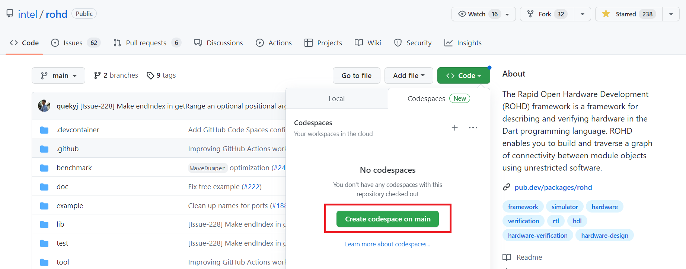
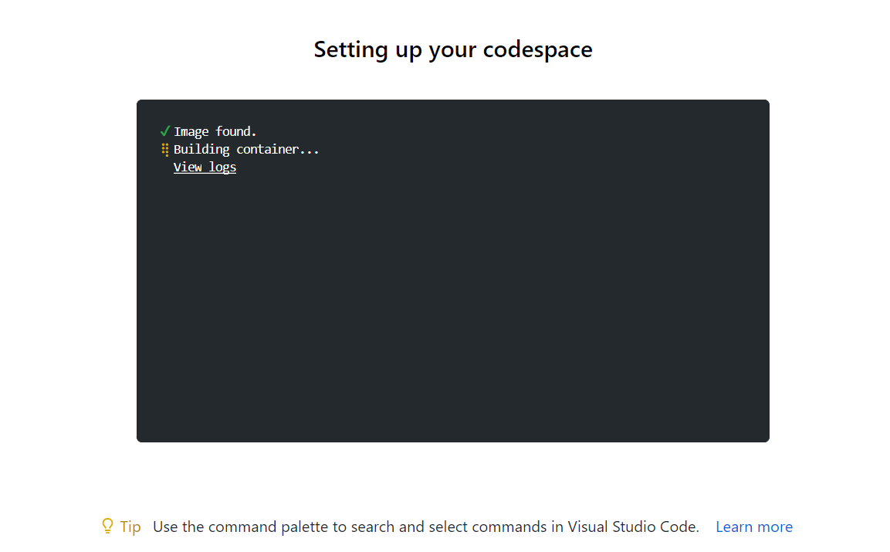
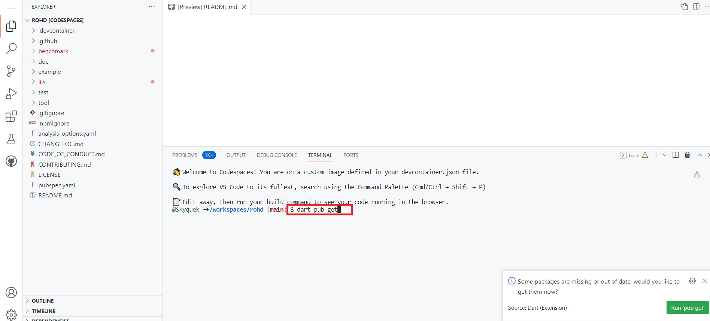
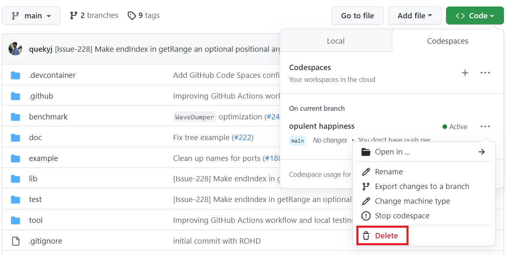

# Setup & Installation

There are two ways of development in ROHD. First, You can run ROHD on GitHub codespace or local machine. 

## Setup on Github Codespace

1. Navigate to https://github.com/intel/rohd and click on Codespaces. Note that everyone have free access to codespace but with monthly quota. Please check on  https://docs.github.com/en/codespaces/overview to know more.

> All personal GitHub.com accounts have a monthly quota of free use of GitHub Codespaces included in the Free or Pro plan. You can get started using GitHub Codespaces on your personal account without changing any settings or providing payment details. You can create and use a codespace for any repository you can clone. You can also use a template to create codespaces that are not initially associated with a repository. If you create a codespace from an organization-owned repository, use of the codespace will either be charged to the organization (if the organization is configured for this), or to your personal account. Codespaces created from templates are always charged to your personal account. You can continue using GitHub Codespaces beyond your monthly included storage and compute usage by providing payment details and setting a spending limit. For more information, see "About billing for GitHub Codespaces.

2. You will be navigate to a page where GitHub will spin up the container for you. Please wait patietly while GitHub preparing your server.

3. When your space is ready, you will see a visual studio code running on your browser.

4. Run `dart pub get` on the terminal of the visual studio code to pull your setup.

5. Open up `example` folder on the left navigation panel and click on `example.dart` to bring forward the first example of ROHD. After that, navigate to the main function at below of line 58 and click on the `Run` at `Run | Debug`.

If you can see SystemVerilog code pop up on the terminal. Well, you have successfully set up your development environment on the cloud.

6. To delete the codespace, go back to https://github.com/intel/rohd and click on codespace just like step 1. But this time, you will see more options. Click on the delete option to delete codespace.

