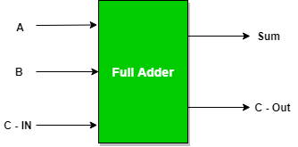
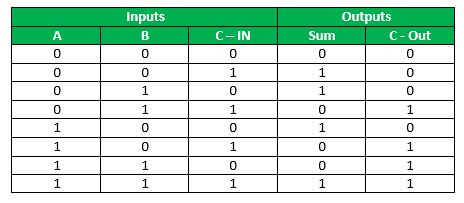

# Unit Testing

## Simple unit test of existing logic

In ROHD, you are encourage to apply test-driven development(TDD) when designing or developing your program. In this module, we are going to see how we can achieve TDD development with the help of dart programming language.

TDD is software development approach in which test cases are developed to specify and validate what the code will do. In simple terms, test cases for each functionality are created and tested first and if the test fails then the new code is written in order to pass the test and making code simple and bug-free.

In this module, we will be creating a **full-adder with TDD development flow**.

Full Adder is the adder that adds three inputs and produces two outputs. The first two inputs are A and B and the third input is an input carry as C-IN. The output carry is designated as C-OUT and the normal output is designated as S which is SUM. A full adder logic is designed in such a manner that can take eight inputs together to create a byte-wide adder and cascade the carry bit from one adder to another. we use a full adder because when a carry-in bit is available, another 1-bit adder must be used since a 1-bit half-adder does not take a carry-in bit. A 1-bit full adder adds three operands and generates 2-bit results.






### Step 1: Importing dart test package

We can start by importing dart test library ``import 'package:test/test.dart'`` and then create a ``main()`` function.

```dart
import 'package:test/test.dart';

void main() {
    // your code here
}
```

### Step 2: Create a failing test (Red Hat)

In TDD, we start by creatign a failing test where its also known as red hat. In our full-adder program, we will create a simple fail test case which say that `SUM` of the full adder will yield:

<!-- | A           | B           |      C        |   SUM     |
| :---        |    :----:   |          ---: |   ---:    |
| 0           | 0           | 0             |      0    |
| 0           | 0           | 1             |      0    |
| 0           | 1           | 1             |      0    |
| 0           | 1           | 0             |      1    |
| 1           | 0           | 1             |      0    |
| 1           | 0           | 0             |      1    |
| 1           | 1           | 0             |      1    |
| 1           | 1           | 1             |      1    | -->

```dart
import 'package:test/test.dart';
import 'package:rohd/rohd.dart';

void main() {
  // Let start by creating all of our port
  final Logic a = Logic(name: 'a');
  final Logic b = Logic(name: 'b');
  final Logic c = Logic(name: 'c');
  Logic sum = Logic(name: 'sum');

  test('should return 0 when A, B, C equal 0', () async {
    a.put(0);
    b.put(0);
    c.put(0);

    expect(sum.value.toInt(), equals(0));
  });
}
```

When you run the test case above, its going to fail and show this:

```dart
00:00 +0: should return 0 when A, B, C equal 0

00:00 +0 -1: should return 0 when A, B, C equal 0 [E]

  Expected: <0>
    Actual: <1>


  package:test_api/src/expect/expect.dart 134:31          fail
  package:test_api/src/expect/expect.dart 129:3           _expect
  package:test_api/src/expect/expect.dart 46:3            expect
  package:rohd_tutorial_new/unit_test/unit_test.dart 6:5  main.<fn>
  package:test_api/src/backend/declarer.dart 215:19       Declarer.test.<fn>.<fn>
  ===== asynchronous gap ===========================
  package:test_api/src/backend/declarer.dart 213:7        Declarer.test.<fn>
  ===== asynchronous gap ===========================
  package:test_api/src/backend/invoker.dart 257:7         Invoker._waitForOutstandingCallbacks.<fn>

00:00 +0 -1: Some tests failed.

Consider enabling the flag chain-stack-traces to receive more detailed exceptions.
For example, 'dart test --chain-stack-traces'.
```

## Step 3: Make Test Pass (Green Hat)

Next, we going to wear a green hat which also mean making test pass. To make test pass, we going to create the `SUM` part of the full-adder. 

```dart
import 'package:test/test.dart';
import 'package:rohd/rohd.dart';

void main() {
  // Let start by creating all of our port
  final Logic a = Logic(name: 'a');
  final Logic b = Logic(name: 'b');
  final Logic c = Logic(name: 'c');
  Logic sum = Logic(name: 'sum');

  // Create the gate
  final out1 = a ^ b;
  sum <= out1 ^ c;

  test('should return 0 when A, B, C all equal 0', () async {
    a.put(0);
    b.put(0);
    c.put(0);

    expect(sum.value.toInt(), equals(0));
  });
}

```

## Step 4: Refractor the code

In this step, we can take our time and chances to review our code and refractor it to look simpler and better. In out case, let us remove `out1` and
change it to a single line of sum.

```dart
import 'package:test/test.dart';
import 'package:rohd/rohd.dart';

void main() {
  // Let start by creating all of our port
  final Logic a = Logic(name: 'a');
  final Logic b = Logic(name: 'b');
  final Logic c = Logic(name: 'c');
  Logic sum = Logic(name: 'sum');

  // Create the gate
  sum <= (a ^ b) ^ c;

  test('should return 0 when A, B, C all equal 0', () async {
    a.put(0);
    b.put(0);
    c.put(0);

    expect(sum.value.toInt(), equals(0));
  });
}
```

Alright, look cleaner now.

## Step 5: Create fail test for C-Out

Alright, so we add a fail test for C-Out.

```dart
import 'package:test/test.dart';
import 'package:rohd/rohd.dart';

void main() {
  // Let start by creating all of our port
  final Logic a = Logic(name: 'a');
  final Logic b = Logic(name: 'b');
  final Logic c = Logic(name: 'c');
  Logic sum = Logic(name: 'sum');
  Logic c_out = Logic(name: 'c_out');

  // Create the gate
  sum <= (a ^ b) ^ c;

  test('should return 0 when A, B, C all equal 0', () async {
    a.put(0);
    b.put(0);
    c.put(0);

    expect(sum.value.toInt(), equals(0));
  });

  test('should return 1 when A equal to 0 and B, C equal to 1', () async {
    a.put(0);
    b.put(1);
    c.put(1);

    expect(c_out.value.toInt(), equals(1));
  });
}
```

## Step 6: Make test for C-Out success

Well, we can create 2 and gate and 1 or gate for C out.

```dart
import 'package:test/test.dart';
import 'package:rohd/rohd.dart';

void main() {
  // Let start by creating all of our port
  final Logic a = Logic(name: 'a');
  final Logic b = Logic(name: 'b');
  final Logic c = Logic(name: 'c');
  Logic sum = Logic(name: 'sum');
  Logic c_out = Logic(name: 'c_out');

  // Create the gate
  sum <= (a ^ b) ^ c;

  final and1 = c & (a ^ b);
  final and2 = b & a;
  c_out <= and1 | and2;

  test('should return 0 when A, B, C all equal 0', () async {
    a.put(0);
    b.put(0);
    c.put(0);

    expect(sum.value.toInt(), equals(0));
  });

  test('should return 1 when A equal to 0 and B, C equal to 1', () async {
    a.put(0);
    b.put(1);
    c.put(1);

    expect(c_out.value.toInt(), equals(1));
  });
}
```

## Exercises:

- Create a half-adder using TDD in ROHD.


## Link to test package from Dart

To learn more trick on unit test on ROHD, you can refer to the [https://pub.dev/packages/test](https://pub.dev/packages/test)
